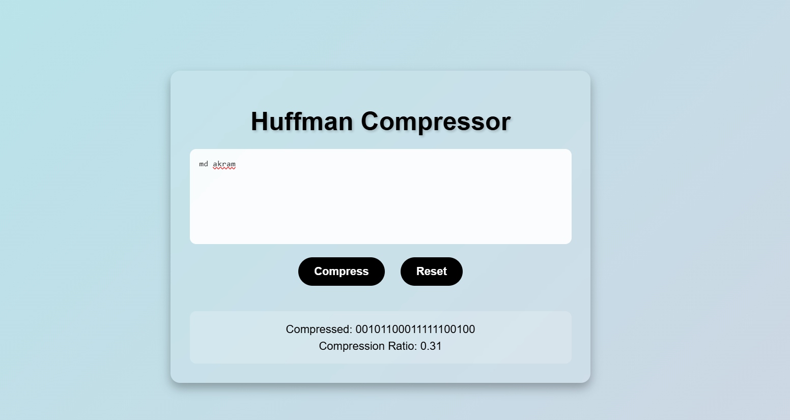

# Huffman Compressor 🔑📦

A **lossless text compression tool** built with **C++** and compiled to **WebAssembly** for blazing-fast performance in the browser.  
It uses the classic **Huffman Coding algorithm** to compress text efficiently and provides a clean, interactive UI for visualization.

---

## 🚀 Features
- **Lossless Compression**: Reduces text size by up to **69%** using Huffman Coding.
- **C++ Core Engine**: Efficient implementation of frequency analysis, priority queues, and binary trees.
- **WebAssembly Power**: C++ code compiled with **Emscripten** for high-performance execution in the browser.
- **Interactive UI**: Built with **HTML, CSS, and JavaScript** to visualize compression statistics and binary encoding.
- **Real-Time Feedback**: Shows frequency table, Huffman tree, and encoded bitstream dynamically.

---

---

## ⚙️ Tech Stack
- **C++** – Core compression algorithm
- **WebAssembly (Emscripten)** – Browser execution
- **JavaScript** – UI interaction & data visualization
- **HTML & CSS** – User interface

---

## 📸 Screenshots

### Homepage


---

## 🛠️ Setup & Run Locally
1. Clone the repository:
   ```bash
   git clone https://github.com/IamAkram321/Huffman-Compressor.git
   cd Huffman-Compressor
📖 How It Works

Enter text into the input area.

The app calculates character frequencies.

Builds a Huffman Tree using a priority queue.

Generates binary codes for each character.

Displays:

Compressed binary representation

Compression ratio


🧠 Learnings

Implemented efficient priority queue (min-heap) in C++.

Bridged native C++ performance with Web UI using WebAssembly.

Applied concepts of data compression, binary trees, and greedy algorithms.

📜 License

This project is open-source and available under the MIT License.
